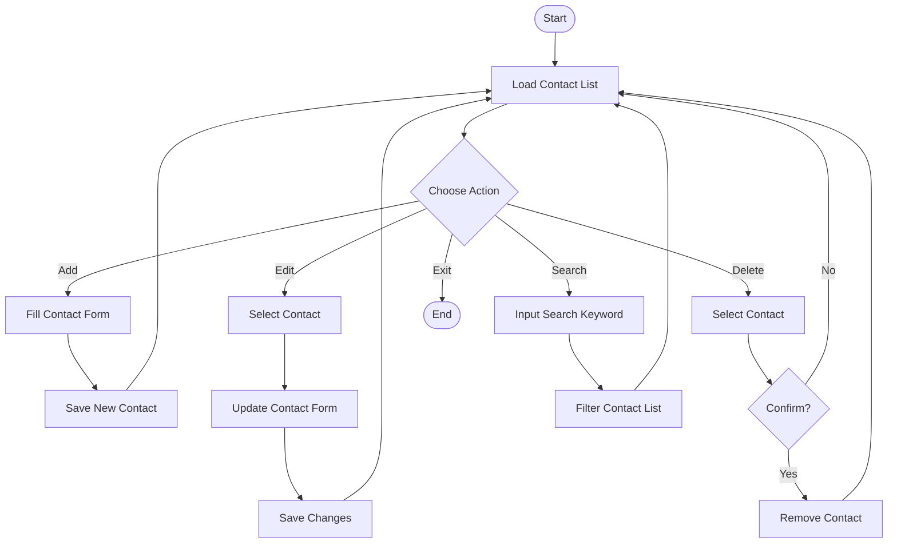

# Address Book

A simple address book application to store and manage contact information.

## 📋 Description

This is a web-based address book application built with HTML, CSS, and JavaScript that allows users to manage their contacts efficiently.

## 🔗 Link

- **Repository**: [\[Repository\]](https://github.com/Madz-21/address-book)

## ✨ Features

- Add, edit, and delete contacts
- Search contacts by name or email
- Responsive design for mobile and desktop
- Clean and intuitive user interface
- Local storage for data persistence

## 🛠️ Tech Stack

- **HTML** - Structure and content
- **CSS** - Styling and layout (with Tailwind CSS)
- **JavaScript** - Functionality and interactivity

## 📊 Flowchart



## 🚀 How to Use

1. Clone this repository:
   ```bash
   git clone https://github.com/Madz-21/address-book.git
   ```

2. Open `index.html` in browser

3. Start managing contacts:
   - Click **"Add Contact"** to create a new contact
   - Click **"Edit"** to modify existing contact
   - Click **"Delete"** to remove a contact
   - Use the search bar to find specific contacts

## 📁 Project Structure

```
address-book/
├── index.html
├── tailwind.config.js
├── address.js
└── README.md
```

## 👨‍💻 Developer

**Name**: Ahmad Sahl Pahlevi                                    
**GitHub**: [\[My Github Profile\]](https://github.com/Madz-21)

